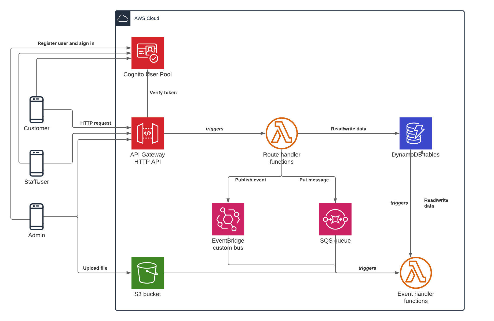

# ROSS: Restaurant Order System with Serverless

## Architecture

The diagram depicts the high-level architecture and the AWS services used by the application.

### User management

A single [Cognito User Pool](https://docs.aws.amazon.com/cognito/latest/developerguide/cognito-user-identity-pools.html) stores user credentials and provide sign-up and sign-in options for all users. Two [User Pool App Clients](https://docs.aws.amazon.com/cognito/latest/developerguide/user-pool-settings-client-apps.html) are created to cater for the two client apps accessing ROSS.

Client apps will directly call the Amazon Cognito API when creating users and logging in.

When a user is logged in, the JWT token returned from Cognito is supplied as a HTTP header in subsequent requests to the API.

### RESTful API

Client apps will send requests to an [API Gateway](https://docs.aws.amazon.com/apigateway/latest/developerguide/welcome.html) HTTP API configured with multiple routes. All API routes that require authentication will be configured to use the Cognito user pool.

### Route handler Lambda functions

All API Gateway routes are configured to invoke a single-purpose Lambda function. This ensures small, focused and testable functions with necessary permissions only, adhering to the principle of least privilege.

Route handler functions via API Gateway are invoked synchronously, meaning that clients keep their HTTP connection open while waiting for the response. Typically route handlers will interact with downstream services such as DynamoDB for database access, EventBridge for signalling business events or SQS for queuing tasks for background processing.

### Event handler Lambda functions

Specialized Lambda functions for processing background tasks are triggered asynchronously from several sources, e.g. [EventBridge](https://docs.aws.amazon.com/eventbridge/latest/userguide/what-is-amazon-eventbridge.html) upon receiving a business event (for example SEATING_CREATED), or from an [SQS queue](https://docs.aws.amazon.com/AWSSimpleQueueService/latest/SQSDeveloperGuide/welcome.html) message requesting a task to be carried out (for example sending an email notification).

### S3 bucket for file storage

Simple Storage Service (S3) is used to store files uploaded by clients. Whenever a post-processing step is required, e.g recording metadata such as image file paths, the S3 bucket will be configured to trigger a Lambda function after files has been uploaded.

### DynamoDB tables

The application uses [DynamoDB](https://docs.aws.amazon.com/amazondynamodb/latest/developerguide/Introduction.html) to persist structured application data.

Data will reside in multiple tables, e.g. Users, Restaurants and Seatings.

## User roles

The application supports three user roles:

- Customers
- StaffUsers
- Managers, i.e. restaurant owner

Three Cognito groups are used to manage the permissions of these roles.

Two Cognito app clients ensures access to Cognito API operations for client applications (frontend's) consuming the ROSS API.

Generally, Cognito will be used to store login credentials only and other user attributes and preferences will be stored in the DynamoDB "Users" table. However, to simplify the registring process for StaffUsers and Managers, the following custom attributes exist for StaffUsers and Managers in Cognito:

- restaurantId
- restaurantRole

_restaurantId_ will hold the id of the restaurant where the user is engaged. _restaurantRole_ can hold values STAFF or MANAGER.

## Client apps

Two client apps will access the API. Client apps will implement functionality for the following sets of [user stories](./user-stories.md).

Core [use cases](./use-cases.md) are described and depicted with architectural diagrams.

### Customer mobile app

In the customers app users can create a new login (user account), find restaurants, create reservations (in the system denoted a seating) and, once actually seated at the restaurant, request ("hail") a server to come to the table.

### StaffUser iPad app

In the staffs app a manager or server can create a new login (user account), create a new restaurant and upload its profile photo, receive notifications when seatings are created by customers, accept or decline seatings, list current and upcoming seatings, assign table and take orders for customers and receive weekly reports by email.
