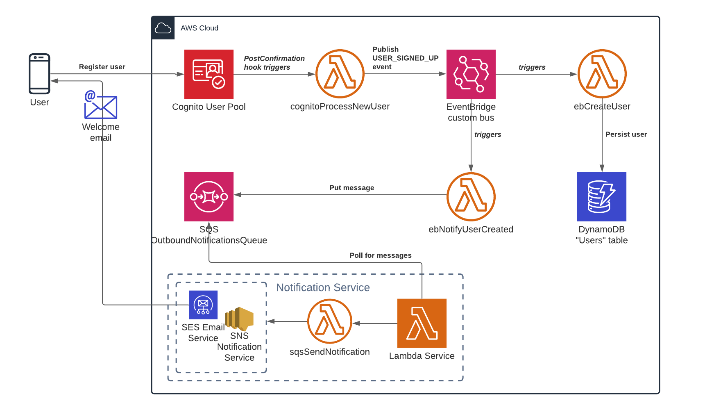
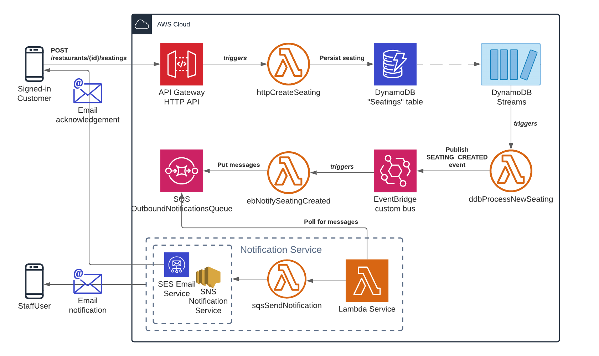

# Core use cases

Core individual use cases are depicted and described in this document.

A complete collection of [user stories](./user-stories.md) also exists.

## Create user

Work in progress ...

## Create seating

Logged-in customers can create new seatings with a paticular restaurant. When persisted, the user will receive an email acknowledgement and all StaffUsers at the restaurant will be notififed via email.

## Update seating status

All seating status updates are handled by explicit HTTP endpoins for a given action, e.g. PATCH `/restaurants/{id}/seatings/{id}/accept` for a StaffUser accepting a seating currently in PENDING state.

From PENDING state a seating can transition to:

- ACCEPTED: A StaffUser accepts the seating. A similar process to "create seating" will start, with a SEATING_STATUS_CHANGED business event raised to EventBridge, resulting in the customer receiving an email notification that the seating was accepted by the restaurant.

- DECLINED: A StaffUser declines the seating. A similar process to "create seating" will start, with a SEATING_STATUS_CHANGED business event raised to EventBridge, resulting in the customer receiving an email notification that the seating was declined by the restaurant.

From PENDING or ACCEPTED state a seating can transition to:

- CANCELLED: A Customer cancels the seating. A similar process to "create seating" will start, with a SEATING_STATUS_CHANGED business event raised to EventBridge, resulting in the customer receiving an email acknowledgement and the restaurant receiving an email notification that the seating was cancelled by customer.

From ACCEPTED state a seating can transition to:

- SEATED: A StaffUser welcomes the Customer at the restaurant, assigns a tableNumber and raises a SEATING_STATUS_CHANGED business event to EventBridge.

From SEATED state a seating can transition to:

- CLOSED: A StaffUser closes the seating when the Customer vacates the table, raising a SEATING_STATUS_CHANGED business event to EventBridge.

## Generate weekly report to Admins

Deliver a weekly report via email every Monday morning to Admin users detailing statistics about restaurant seatings during the past 7 days.

